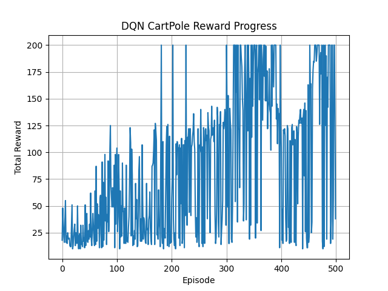

#  DQN CartPole Agent (PyTorch + OpenAI Gym)

This project implements a Deep Q-Network (DQN) to solve the CartPole-v1 environment using PyTorch and OpenAI Gym.
I am a student self-learning AI. If you spot any mistake or have suggestions, I would truly appreciate your help and feedback 🙏
This repository is part of my learning journey, and any constructive advice is welcome!

## Features
- Custom replay buffer
- Epsilon-greedy policy
- Target network with delayed updates
- Reward plot after training
- Demo with video playback

## Training
```bash
python dqn_cartpole.py
```
## 🎥 Demo Agent
```bash
python demo_cartpole_beautiful.py
```
This will run the trained agent and save a video to videos/demo_ep1.mp4

## 📊 Reward Progress


## 📦 Dependencies
```bash
pip install torch gym[classic_control] imageio matplotlib
```

## 📌 Notes
- Model is trained using pure PyTorch (no stable-baselines).
- If you're reading this and have suggestions, feel free to open a PR!

## 💡 Thanks for reading – and I appreciate any feedback or improvement suggestions 🙏
